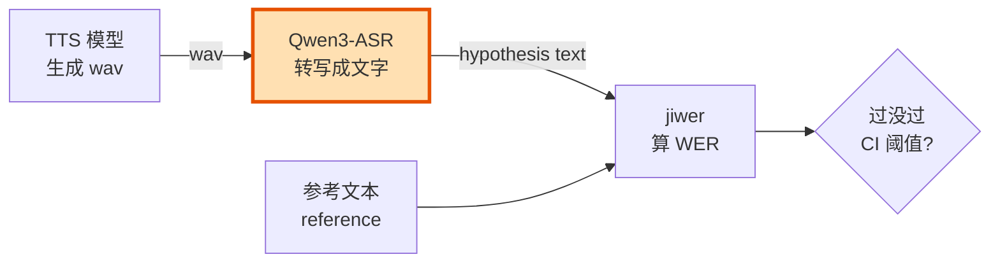
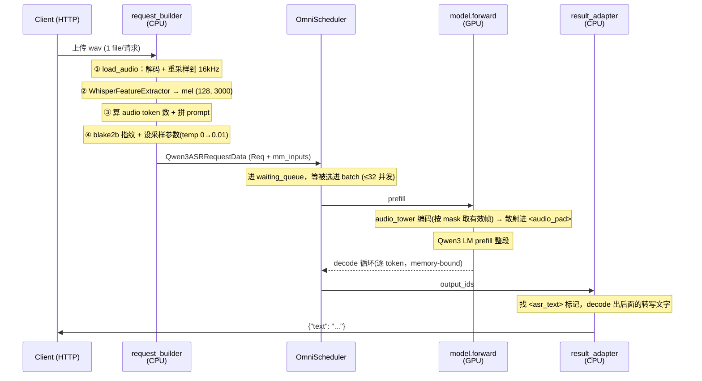

# 00 · Foundation — 把 Qwen3-ASR 跑得更快

> **这份文档是干嘛的**
> 这是 issue #831（*[Good First Issue] Optimize Qwen3-ASR for faster TTS WER evaluation*）的「地基」章节。
> 读完它，你不会写出第一行优化代码——但你会**完全知道自己站在哪、敌人是谁、子弹在哪、红线在哪**。
> 真正动手（profile → 找瓶颈 → 改 → 测）是 `01+` 的事。这一篇只负责一件事：**让你对这块代码有 taste，有地图，有判断力。**
>
> **怎么读（ADHD 友好版）**
> 每一节末尾都有一个 `🎯 一句话` 收尾。如果你只想抓骨架，**先把所有 🎯 扫一遍**，再回来读你最想读的那节。
> 全文按「一个请求的旅程」组织，是一条线，不是一堆知识点。跟着线走就行。

---

## 0. TL;DR — 30 秒拿到全局

SGLang-Omni 用 **Qwen3-ASR 把 TTS 生成的语音转写成文字，再算 WER**，以此判断 TTS 模型说得对不对。
所以 ASR 不是一个边角功能——它**坐在评测的 hot path 上**：每一次 TTS 正确性检查都要等 ASR 把音频转写完。ASR 慢一秒，整条 CI、每个人的 TTS 迭代都慢一秒。

你的任务：**让 Qwen3-ASR generally faster，并且拿数字说话**（before/after + benchmark 命令 + 跑在什么硬件上）。



> 🎯 **你优化的不是「一个模型」，是「整条 TTS 评测流水线的吞吐」。ASR 是那个卡脖子的环节。**

---

## 1. 先想清楚：这道题真正在考什么

这是一道 **Good First Issue**，但别被「first」骗了——它考的不是「你能不能把某个数字调小」，而是**你做性能优化的工程素养与流程**。issue 原文里藏了三条评分线：

1. **拿数字说话。** “A perf claim without a benchmark behind it isn't actionable.” 没有 benchmark 的「我觉得快了」= 0 分。
2. **复用，别重造。** server 启停、benchmark harness、scheduler——仓库里全有。你要是开始 copy-paste，那是个信号：该抽一个 shared helper，而不是再写一遍。
3. **负责任地用 AI。** 他们明说欢迎你用 AI 导航代码、用 profiler、起草抽象——但 **own the result**：你得真懂你改了什么、验证过、不交「filler comments + 没验证的 perf 数字」。

换句话说，**这道题在考你的「优化闭环」纪律**：

```
立 hypothesis  →  profile 验证  →  定位真瓶颈  →  改  →  benchmark  →  核对 WER 没退化 + 速度真变好  →  写下 before/after + 命令 + 硬件  →  PR
```

整篇 `00` 的目的，就是把这个闭环里每一环需要的「地形知识」一次性喂给你。

> 🎯 **赢的方式不是「改得多」，是「证据链完整 + 复用干净 + 自己真懂」。**

---

## 2. SGLang-Omni 的世界观（只讲你需要的那部分）

你不需要懂整个框架。但你需要懂**一句话的心智模型**，否则你会在目录里迷路。

SGLang-Omni 是一个 **computation-centric 的多阶段（multi-stage）流水线运行时**。它的世界观是：一个 omni 模型（比如会说话的 LLM）天然能拆成几个**计算特性完全不同**的 stage——compute-bound 的 thinker、memory-bound 的 talker、latency-sensitive 的 codec——所以**每个 stage 跑自己的 scheduler，各自按自己的瓶颈调优**，stage 之间靠 inbox/outbox + 零拷贝共享内存通信。

请求在系统里的生命线是这样一条链（记住它，整个仓库都按它分层）：

```text
HTTP API → Client → Coordinator → Stage → Scheduler → ModelRunner → model forward
```

| 层 | 干的事 | 认不认识具体模型？ |
|---|---|---|
| **Coordinator** | 请求路由进 entry stage、收终态结果、广播 abort | ❌ 不认识 |
| **Stage** | 纯 IO 壳：收发控制消息、读写 relay、把活塞进 `scheduler.inbox`、从 `outbox` 抽结果 | ❌ 不认识 |
| **Scheduler** | 选 batch、管 KV cache、派发 forward | 🟡 半认识 |
| **ModelRunner** | 真正的 forward、采样、模型专属 hook | ✅ 认识 |

关键设计哲学（你优化时会反复用到）：**Stage 永远不 branch on scheduler 类型**。`OmniScheduler`、`SimpleScheduler`、`Code2WavScheduler` 对外长一个样（都是 `inbox` / `outbox` / `start` / `stop` / `abort`）。这意味着你改 ASR 的内部，不会震到框架层——**ASR 是一个可以被单独拎出来推理的盒子**。

还有一个你必须知道的事实：**`OmniScheduler` 不是自己手写的调度器，它 compose 了上游 SGLang 的 Scheduler**——复用了 SGLang 的 batch 选择、KV cache 管理、prefill/decode 调度、tree cache、CUDA Graph、continuous batching。SGLang-Omni 只把 transport / 请求对象 / 流式行为留在外面。

> 为什么这对你重要：你能用的「加速弹药」很大一部分**来自 SGLang 本身**（CUDA graph、overlap schedule、attention backend、torch.compile、采样后端……），而这些都是通过 `server_args` 的 overrides 在 ASR 的 stage factory 里被设定的。下一节你就会看到这堆开关。

> 🎯 **记住这条链 `HTTP→Client→Coordinator→Stage→Scheduler→ModelRunner→forward`，再记住「ASR 是这条链里最简单的一个盒子」。**

---

## 3. Qwen3-ASR 到底是什么模型（别把它当 Whisper）

这是全篇最容易踩坑的认知点，先把它钉死。

**Qwen3-ASR ≠ Whisper 式的 encoder-decoder。**
它是一个 **Qwen3 因果语言模型（1.7B）+ 一个 audio encoder（"audio tower"）**。音频不是喂进一个独立 decoder，而是被当成 **multimodal embedding**：

- prompt 里塞了一串 `<|audio_pad|>` 占位符，**数量 = 这段音频会产生多少个 audio token**；
- 模型 forward 时，`general_mm_embed_routine` 把 audio encoder 的输出**散射（scatter）进这些占位符的位置**；
- 然后就是一个**普普通通的 Qwen3 LM**：prefill 这段「音频 token + 文字 prompt」，再 autoregressive decode 出转写文字。

代码里这段注释把它说得很清楚（`request_builders.py:4-12`）：
> Unlike Whisper (encoder-decoder, features consumed inside the model forward), Qwen3-ASR is a Qwen3 causal LM that ingests audio as multimodal embeddings…

### 3.1 目录地图：`sglang_omni/models/qwen3_asr/`

这个文件夹小而完整，是你的主战场。逐个认识一下：

| 文件 | 角色 | 你会盯着它的原因 |
|---|---|---|
| `config.py` | `Qwen3ASRPipelineConfig`：**单 stage** 流水线，`asr` 一个 stage，`terminal=True`，跑在 GPU 0，`max_running_requests=32` | 整个 ASR 就一个 stage——拓扑简单到可以全装进脑子 |
| `stages.py` | `create_sglang_qwen3_asr_executor(...)`：**stage 工厂**，所有 server_args / 性能开关在这里设定 | ⭐ **所有「配置型」加速开关的总闸都在这** |
| `request_builders.py` | `StagePayload → Qwen3ASRRequestData` 的转换：load 音频、抽 mel、拼 prompt、设采样参数 | ⭐ **per-request 的 CPU 准备开销全在这** |
| `sglang_model.py` | `Qwen3ASRForConditionalGeneration`：audio tower + Qwen3 LM + `forward` | GPU 上真正算的地方（encoder + LM） |
| `audio_lengths.py` | mel 帧数 → audio token 数 的公式 | 决定 prefill 有多长 |
| `configuration_qwen3_asr.py` | HF config / processor 定义 | 看模型结构时翻 |

> 🎯 **Qwen3-ASR = Qwen3 LM + audio tower，音频走 multimodal embedding。整条 ASR 只有一个 stage——它是这个框架里最干净的一个盒子，正好适合被你彻底吃透。**

---

## 4. 一个转写请求的一生（centerpiece，慢慢读）

这是全篇的核心。把一个 `/v1/audio/transcriptions` 请求从音频字节到转写文字的旅程走一遍，你就知道「时间可能花在哪」了。



### 4.1 CPU 段：`request_builder`（`request_builders.py:168-277`）

每个请求进来，先在 **CPU 上单线程**做这些事：

1. **`load_audio`**（`:72-92`）：torchaudio 解码任意格式，转单声道、float32、**重采样到 16kHz**。
2. **抽 mel 特征**（`:174-180`）：`WhisperFeatureExtractor` 产出 `(128, 3000)` 的 mel——**注意，永远 padding 到 3000 帧（= 30 秒）**，外加一个 attention mask 标记哪些帧是真的。
3. **算 audio token 数**（`:190-191`）：`num_mel_frames = mask.sum()`，再过 `audio_lengths.py` 的公式。
4. **拼 prompt**（`_build_prompt_ids`, `:154-166`）：
   ```text
   <|im_start|>user\n<|audio_start|> {N×<|audio_pad|>} <|audio_end|><|im_end|>\n
   <|im_start|>assistant\nlanguage <Lang><asr_text>
   ```
   ⚠️ 那句 `language English<asr_text>` 的**强制前缀不能删**——小模型没有它会「只吐个语言标签就停」。
5. **算指纹**（`:172`）：`blake2b` 对**整段波形**做哈希（用于 mm cache key / `extra_key`）。
6. **设采样参数**（`:238-253`）：`temperature` 传 0 会被**强行抬到 0.01**（纯 greedy 会退化），`top_p=1.0`，停在 eos，`max_new_tokens` 默认走 stage 的 256（WER 路径会传 128）。

> 💡 **这里就是第一个值得 profile 的地方。** 模型本体只有 1.7B，音频又短（SeedTTS 大多几秒），但上面这 6 步是**纯 Python、单请求串行**的：解码、重采样、对整段波形做 mel（永远 3000 帧）、blake2b 哈希整段波形……当模型工作量很小的时候，这些「固定 per-request 开销」很可能**占比惊人**。先别信我（也别信任何 AI）说它一定是瓶颈——`scheduler_request_build_start/_end` 这个 profiler 区间就是专门量它的，去量。

### 4.2 GPU 段：`model.forward`（`sglang_model.py:111-127`）

进了 scheduler、被选进 batch 后，真正的算力在这里：

- **audio tower 编码**（`get_audio_feature`, `:72-109`）：把 mel 喂进 `Qwen3OmniMoeAudioEncoder`。
  **关键细节**：它**用 attention mask 先把 padding 帧筛掉**（`:85-94` 那段 `feature_attention_mask.bool()` 的 indexing），只把**有效帧**喂给 encoder。
  → 所以 encoder 的计算量是**随实际音频长度走的**，不是固定 3000 帧。**别传那个「padding 浪费了 97% encoder 算力」的谣言**——GPU encoder 没有；浪费（如果有）在 CPU 侧那个永远 3000 帧的 feature extraction。
- **散射 + LM prefill**：`general_mm_embed_routine` 把 audio embedding 塞进 `<|audio_pad|>` 的位置，拼上文字 embedding，过 Qwen3 LM。
- **decode 循环**：autoregressive 逐 token 吐转写文字，最多 32 个请求一起 batch。

### 4.3 把数量级装进脑子（非常重要的直觉）

用 `audio_lengths.py` 的公式：**每 100 mel 帧 → 13 个 audio token**。
mel 帧率约 100 帧/秒，所以：

- 一段 **5 秒** 的 clip ≈ 500 帧 ≈ **65 个 audio token**；
- prompt 文字才二十几个 token；
- decode 出的转写也就几十个 token。

也就是说，**一次转写 = 一个约百来 token 的 prefill + 几十 token 的 decode，模型还只有 1.7B。** 这点工作量在 H100/H200 上是「一眨眼」。

再对一下 CI 实测：mean latency ≈ **0.127 秒/请求**，RTF ≈ **0.025**（延迟只占音频时长的 2.5%）。
**一个百来 token 的 1.7B 推理要花 127ms？** 这强烈暗示：**时间不在 FLOPs 上，而在「固定开销」上**——kernel launch、CUDA graph replay、调度往返、per-request 的 CPU 准备、采样后端、Python 开销……

> 🎯 **核心直觉：Qwen3-ASR 的「活」很小，所以瓶颈大概率是「固定 per-request 开销」而非纯算力。这正是为什么 issue 反复强调「profile，看时间到底去哪了」，而不是拍脑袋。把这条当成你 01 章 profile 的头号假设——然后用数据证伪或证实它。**

---

## 5. 时间可能花在哪：一份「假设清单」（每条都要 profile 验证）

下面是**候选**——不是结论。你的 01 章工作就是用 profiler 把它们一个个证伪或证实。它们都来自我读过的真实代码，给你的是「该往哪看」，不是「就改这个」。

### 5.1 配置型开关（总闸在 `stages.py:47-59`）

ASR 的 stage 工厂里写死了一堆 `server_args` overrides。每一个都是一个**可量化的实验**：

| 开关（`stages.py`） | 当前值 | 为什么值得 profile |
|---|---|---|
| `disable_overlap_schedule` | `True`（`:49`） | overlap scheduling 被**关了**。开了能让 CPU 调度和 GPU 计算重叠——对「固定开销主导」的小模型可能是大头。**但要实测 + 看 WER 不退化。** |
| `mm_embedding_cache_size_bytes` | `0`（默认，`:97`） | audio embedding cache **关着**。只有「同一段音频被重复转写」时才有用——correctness gate 跑同样 20 条 + warmup，会重复；但真实 WER 路径转的是**各不相同**的 TTS 输出，缓存不命中。**别盲目开，先想清楚命中率。** |
| `cuda_graph_max_bs` / `max_running_requests` | `32` | CUDA graph 覆盖到 bs=32。并发实际多少、graph 有没有覆盖到、replay 开销多大，值得看。 |
| `chunked_prefill_size` / `max_prefill_tokens` | `4096` | prefill 才百来 token，4096 的 chunk 对 ASR 基本用不上——但也说明这不是瓶颈方向。 |
| `sampling_backend` | `"pytorch"` | 用的是 pytorch 采样后端而非 flashinfer。小输出下采样开销占比可能不低。 |
| `enable_torch_compile` | `False` | torch.compile 关着。开了首次编译贵，但稳态可能快——权衡 + 实测。 |
| `mm_attention_backend` | SM≥100 用 `triton_attn`，否则默认 | encoder 的 attention 后端按 GPU 架构切。换后端是常见提速点。 |
| `dtype` | `float16` | 精度/速度权衡的旋钮之一。 |

还有一个**拓扑层面**的旋钮：CI 和 benchmark 起 ASR 时用的是 **omni router + 多 worker（`--dp-size 2`）**（见 `benchmark_qwen3_asr_concurrency.py:26-30`）。也就是说线上是「一个 router 扇出到若干 replica」。**「加速」既可以是「单请求更快」，也可以是「同样硬件下吞吐更高」**——两条路都算数。

### 5.2 Per-request CPU 准备（`request_builder`，见 §4.1）

`load_audio` 解码/重采样、永远 3000 帧的 mel 特征抽取、对整段波形 blake2b 哈希、prompt tokenization……都是**单请求串行的 Python**。模型很小，这些就显眼。`scheduler_request_build_start/_end` 区间专门量它。

### 5.3 prefill / decode 的固定开销

百来 token 的 prefill + 几十 token 的 decode，**kernel launch、graph replay、调度往返**这些 per-step 固定成本，在小工作量下占比会被放大。torch profiler 的 Chrome trace 能让你看清「GPU 到底在算，还是在等」。

> 🎯 **这一节是「线索板」，不是「答案」。你的纪律是：先 profile（§6 的工具），让数据告诉你时间去哪了，再决定动哪个旋钮。任何「我觉得是这个」——包括 AI 给你的——在 trace 面前都只是待验证的假设。**

---

## 6. 你的工具箱（issue 明说：复用，别重造）

好消息：**测量基建已经全在仓库里了**。issue 原话——“All the profilers you need are already here.” 你的活是**用好它们**，不是再写一套。

### 6.1 两个 profiler（`docs/developer_reference/profiler.md`）

1. **Request-level event recorder**（首选，便宜）：往 JSONL 里记每个请求的里程碑（admission、preprocess、encoder、prefill、first token、hops、terminal）。能重建**单请求时间线**，也能跨 batch **聚合每个 stage/hop 的耗时**。对你最有用的区间：`scheduler_request_build_start/_end`（CPU 准备）、`scheduler_prefill_start`（进 prefill）。
2. **Torch profiler**（深挖用，opt-in）：产出 Chrome trace，看 kernel 级 CPU/CUDA 活动。shapes/memory/stack/flops 这些贵的内省**默认关**，按需用 `SGLANG_TORCH_PROFILER_*` 环境变量开。

**HTTP 控制面**（server 起来后直接 curl）：

```bash
# 只记便宜的 event（不带 kernel trace）
curl -X POST http://localhost:8000/start_request_profile \
     -d '{"run_id":"asr-001","event_dir":"/tmp/profiles/asr-001/events"}'
# … 打流量（跑 benchmark）…
curl -X POST http://localhost:8000/stop_request_profile -d '{}'

# 生成报告（timeline / stage breakdown / hop breakdown）
python -m sglang_omni.profiler /tmp/profiles/asr-001/events --format table
```

想要 kernel trace 就用 `/start_profile`（默认 `enable_torch=true`），并设 `SGLANG_TORCH_PROFILER_DIR`，trace 落成 `*.trace.json.gz`，丢进 `chrome://tracing` 或 `ui.perfetto.dev` 看。

### 6.2 Benchmark harness（`benchmarks/benchmarker/`）

- `BenchmarkRunner` + `RunConfig`（`runner.py`）：管并发的请求派发——`max_concurrency`、`request_rate`、`warmup`、`timeout_s`，自动记 `wall_clock_s`。**并发与 warmup 不要自己写循环，用这个。**
- `RequestResult`（`data.py`）：统一的结果结构（`latency_s`、`audio_duration_s`、`rtf`、`is_success`…）。
- `benchmarks/metrics/wer.py`：`calculate_wer_metrics`（corpus + per-sample WER，基于 jiwer）、`calculate_asr_speed_metrics`（throughput / latency 百分位 / RTF）。

### 6.3 Server 启停（别手搓 subprocess）

- `benchmarks/benchmarker/utils.py`：`managed_omni_server(...)` context manager、`start_server_from_cmd` / `stop_server` / `wait_healthy` / `wait_for_gpu_memory_release`。
- `tests/test_model/omni_router_utils.py`：`launch_managed_router(...)` / `ManagedRouterHandle` / `router_worker_traffic_guard`——**router + 多 worker 拓扑**（CI 就用这个起 ASR）。

### 6.4 ⭐ 你的「标准复现命令」（直接照抄）

ASR 性能的**官方 benchmark 脚本**已经存在：`benchmarks/eval/benchmark_qwen3_asr_concurrency.py`。它和 CI gate **共用**同一套 `run_asr_transcription` / `build_asr_eval_results`——意味着你 benchmark 出来的口径，和 CI 卡你的口径，是**同一把尺**。

```bash
# ① 备数据集（一次就行）
python -m benchmarks.dataset.prepare --dataset seedtts

# ② 起 Qwen3-ASR（DP=2，对齐 TTS CI）
python -m sglang_omni.cli serve \
    --model-path Qwen/Qwen3-ASR-1.7B \
    --dp-size 2 \
    --port 8000

# ③ 扫并发矩阵，每档重复 3 次（产出 issue 要的 before/after 数据）
python -m benchmarks.eval.benchmark_qwen3_asr_concurrency \
    --port 8000 \
    --concurrencies 1,2,4,8,16,32,64 \
    --repeats 3

# 快速检查（20 条 correctness 子集）
python -m benchmarks.eval.benchmark_qwen3_asr_concurrency \
    --port 8000 --max-samples 20 --concurrencies 2,32 --repeats 3
```

> 🎯 **profiler + harness + 启停 + 复现脚本，全是现成的。你的 before/after 必须用这套现成口径产出——这既省事，又正好对上 issue 的「复用」和「拿数字说话」两条评分线。**

---

## 7. 游戏规则：CI 红线（改之前先背下来）

ASR 的正确性 + 速度门禁在 `tests/test_model/test_qwen3_asr_ci.py`。它取 **SeedTTS 英文前 20 条**，过 router 转写，然后卡这些阈值（参考值由 `tune.py` 按 **worst-of-N** 标定，再留 slack）：

| 指标 | 参考值（ref） | slack | 实际阈值 | 方向 |
|---|---|---|---|---|
| corpus WER | 0.70% | ×1.1 | ≤ **0.77%** | 不能更高 |
| per-sample WER max | 6.67% | ×1.1 | ≤ **7.34%** | 不能更高 |
| throughput | 15.62 samples/s | ×0.9 | ≥ **14.06 samples/s** | 不能更低 |
| latency mean | 0.127 s | ×1.1 | ≤ **0.140 s** | 不能更高 |
| latency p95 | 0.166 s | ×1.1 | ≤ **0.183 s** | 不能更高 |
| RTF mean | 0.0252 | ×1.1 | ≤ **0.0277** | 不能更高 |
| RTF p95 | 0.032 | ×1.1 | ≤ **0.0352** | 不能更高 |

两个**必须记住**的事实：

1. **WER 是第一红线，不可退化。** 任何让模型更快但把转写质量搞差的改动 = 直接挂。速度优化的本质是「在 WER 不变的前提下更快」。
2. **门禁跑在 concurrency=2**（workflow 里 `QWEN3_ASR_CI_CONCURRENCY: "2"`，`test-tts-ci.yaml:57`，stage 超时 30min）。注意 `throughput ≈ concurrency / latency`：2 / 0.127 ≈ 15.7。所以在低并发下，**throughput 几乎完全由 latency 决定**——压低单请求 latency，throughput 自然上去。

> **配套技能**：仓库有个 `tune-ci-thresholds` 流程，专门在 CI 复现机上重跑 N 次、取 worst-of-N，把新基线写回测试文件。**如果你的优化真的把指标改善了，阈值需要重新标定**——别手改这些魔数，用那个流程。

另外，TTS 主 CI（`test-tts-ci.yaml`）里，stage-2/3 的 **WER 步骤会用 ASR（concurrency 32，WER 超时 600s）转写每一条 TTS 输出**。所以你让 ASR 更快，**整条 TTS CI 都会受益**——这正是 issue 的立意。

> 🎯 **三条红线焊死在脑子里：①WER 不许退 ②速度指标不许退（最好进） ③门禁在 concurrency=2，latency 就是 throughput。改完务必用 §6.4 的命令自测过线，再 PR。**

---

## 8. 你的作战循环 + 陷阱清单

把前面所有东西收束成一个可执行的循环（这就是 `01+` 你要做的事）：

```text
1. 立假设   ── 默认头号嫌疑：固定 per-request 开销（§4.3）
2. profile  ── 先 event recorder 看 stage/区间 breakdown，再 torch trace 深挖热点窗口（§6.1）
3. 定位     ── 让数据指认真瓶颈，证伪/证实假设（包括 AI 给的假设）
4. 改       ── 优先动一个旋钮 / 抽一个能复用的 helper，别一把梭
5. benchmark ── 用 §6.4 的标准命令，warmup 充分，多 repeats
6. 核对     ── WER 没退（§7 红线）+ 速度真的进步
7. 记录     ── before/after 数字 + 确切命令 + 跑在什么硬件（H100/H200…）
8. PR       ── 解释你「为什么这么改」，附完整证据链
```

**陷阱清单（血泪预防）：**

- ❌ **没 warmup 就测**：冷启动/首次 CUDA graph 捕获/torch.compile 首编译会污染数字。`RunConfig.warmup` 用起来。
- ❌ **不报硬件**：H100 和 H200 数字不可比，issue 明确要 hardware。
- ❌ **换了数据集/口径**：用同一套 SeedTTS + 同一套 `run_asr_transcription`，否则 before/after 不可比。
- ❌ **为了快牺牲 WER**：第一红线，直接挂。
- ❌ **盲信「padding 浪费 97% encoder」之类的二手结论**：encoder 按 mask 取有效帧，算力随实际长度走（§4.2）。
- ⚠️ **`get_audio_feature` 的 no-mask 分支有已知 bug**（transpose 不对，见 `request_builders.py:187-189` 的注释），所以 mask path 必须走——别在这上面「优化」掉 mask。
- ⚠️ **`temperature=0` 会被抬成 0.01**（纯 greedy 会退化）；动采样相关的东西时记得这点。
- ⚠️ **公开 `/v1/audio/transcriptions` 端点不暴露 `max_new_tokens`**（cookbook 说明），它走 stage 默认（256）；WER 路径在内部传 128。

> 🎯 **这道题的胜负手是「闭环纪律」，不是「灵光一现」。先 profile 再动手，每一步留证据，WER 焊死不退——这就是他们想看到的「responsible AI use with real results」。**

---

## 9. 你现在已经知道的（自检清单）

读到这，你应该能不看代码答出：

- [ ] ASR 为什么重要？→ 它在 TTS WER 评测的 hot path 上，慢一秒整条评测/CI 慢一秒。
- [ ] Qwen3-ASR 是什么结构？→ Qwen3 LM(1.7B) + audio tower，音频走 multimodal embedding 散射进 `<|audio_pad|>`。
- [ ] 一个请求的旅程？→ CPU 准备(load/mel/prompt/指纹/采样) → scheduler 选 batch → GPU(encoder 按 mask + LM prefill + decode) → 取 `<asr_text>` 后的文字。
- [ ] 头号瓶颈假设？→ 模型工作量极小（百来 token / 1.7B），瓶颈大概率是固定 per-request 开销；**但要 profile 证。**
- [ ] 工具在哪？→ event recorder + torch profiler（HTTP 控制面）、`BenchmarkRunner`、`managed_omni_server`/`launch_managed_router`、`benchmark_qwen3_asr_concurrency.py`。
- [ ] 红线是什么？→ WER 不退（corpus ≤0.77%）、速度不退（throughput ≥14.06、latency mean ≤0.140s）、门禁在 concurrency=2。
- [ ] 怎么算赢？→ 复用现成抽象 + profile 驱动 + before/after+命令+硬件 + 自己真懂。

如果上面有任何一条你答得心虚，回到对应小节再扫一遍那个 🎯。

---

### 接下来（`01+` 会展开，本篇不做）

- `01` · **Profile 实操**：起 server → 打流量 → event recorder + torch trace → 读出「时间真正去哪了」，把 §5 的假设逐条证伪/证实。
- `02` · **第一个优化 + 复用抽象**：基于 profile 结论动一个旋钮 / 抽一个 helper，跑标准 benchmark，核对红线。
- `03` · **写 PR**：before/after 表 + 命令 + 硬件 + 「为什么」，必要时用 `tune-ci-thresholds` 重标基线。

> **一句话送你上路**：模型很小，所以**真相在 trace 里，不在直觉里**。先 profile，再开口。
